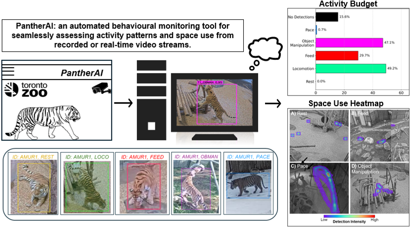
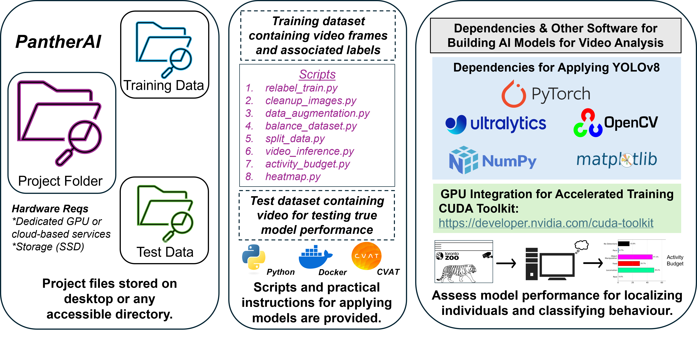
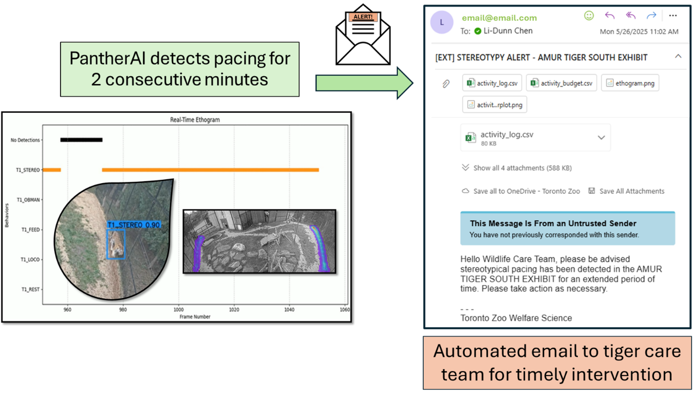

# PantherAI: an autonomous behavioural monitoring tool for assessing activity budget and space use in a zoo-housed tiger
Li-Dunn Chen, Stephen Dodds, Molly McGuire, Maria Franke, Gabriela Mastromonaco (Toronto Zoo Wildlife Health Unit)


## Description
This repository contains code for the PantherAI behavioural monitoring framework, a computer vision method that can be used for real-time monitoring of CCTV livestreams for generating metrics such as activity budget and space use heatmaps.

Please refer to the tutorial ["YOLO-Behaviour pipeline from Chan et al. (2025)"](https://alexhang212.github.io/YOLO_Behaviour_Repo/) for full installation and implementation guidelines, as well as our [paper](ADD LINK) for detailed description of the methods used.




## Abstract

> Machine learning (ML)-aided technologies can be applied to many of the existing wildlife science tools (e.g., camera traps) used to support conservation initiatives both in situ and ex situ. The automated nature of ML methods reduces manual labour, extends monitoring efforts past regular daylight/working hours, and improves the overall diagnostic capacity of tools routinely applied by wildlife biologists and animal care staff at zoological institutions. Though the conservation aims and expectations may differ among zoos and aquariums, simple monitoring tools that impose less demand on animal care staff should serve as an important aid for advancing management strategies for threatened species. We applied computer vision-based predictive models built on CCTV footage from zoo-housed Panthera tigris to develop an automated behavioural monitoring tool (“PantherAI”) capable of rapidly assessing activity budget and space use across variable lighting and weather conditions. We applied YOLOv8 as the model backbone to detect and classify several tiger behaviours (e.g., stereotypical pacing, resting, enrichment interaction, feeding); the trained models were then applied with scripts to autonomously generate customized activity budgets and space use heatmaps from 24-hour video samples. PantherAI yielded a mean average precision >75% on test data, where it detected and classified tiger behaviours with varying levels of accuracy (stereotypical pacing: 100%, resting: 84%, locomotion: 81%, feeding: 43%, object manipulation = 40%). Activity budgets varied (p<0.05) across habitats and by time of day for several behaviours. PantherAI provided reliable estimates of behaviour and space usage, two important ecological metrics commonly used to establish baseline activity budgets and assess indicators of animal welfare. Overall, ML-coupled technologies can facilitate daily data collection and monitoring procedures, both of which are integral for objectively measuring behavioural outcomes as newly implemented husbandry practices (e.g., alterations to diet, environment, social group, enrichment) are enacted in zoological and other ex situ conservation settings. 


## Quick Start
We provide a whole pipeline from data annotation to model training to inference in the [Documentation](INSERT LINK TO REPO). Here, we will run a quick demo inference visualization. Make sure you download the [sample dataset containing images and associated behavioural labels](./Data). In the near future, video walkthroughs will be provided.

### Installation
There are a series of required packages to run the pipeline. We recommend creating a [conda environment](https://www.anaconda.com/). For ease of deployment, we recommend the use of a command line interface such as Anaconda Prompt or a code editor such as like VS Code. 

You can create a new environment and install required packages by running:
```
conda create -n ENVIRO python=3.8 
conda activate ENVIRO
cd Desktop/PantherAI

pip install -r requirements.txt
```
* "ENVIRO" is the name of the working environment and can use any name
* Use the cd command to set the file directory to where all your data and script are located

### Run Inference on Sample Data
After installation and downloading the sample dataset, run this in the terminal, making sure that the current working directory is in `PantherAI_Repo`. You can change your working directory by using the "cd" command:  `cd /path/to/PantherAI_Repo`

Please refer to the manuscript cited below for details regarding the YOLO file structure for deploying the PantherAI pipeline. Note that several files and associated scripts are needed to 1) preprocess data, 2) prepare data for analysis, 3) train models, and 4) deploy models for real-time monitoring, as well as generating activity budget plots and space use heatmaps. 
* In addition to training data (images and associated labels/annotations), a train.txt file, .yaml file, and pretrained model weights [("yolov8m.pt"](https://huggingface.co/Ultralytics/YOLOv8)) are needed for training and deploying predictive models on livestream video footage or precorded video sequences. These files can be found in the [Data](./Data) and [Code](./Code) folders.
  


```
python 10_video_inference.py
```
[](https://github.com/lidunnchen/PantherAI/blob/main/Images/SupplementalVideo1_c28_loco_obman.mp4) 

Videos can be processed faster than real-time for retroactively assessing behavioural profiles. For example, the script, "07_activity_budget" can be used to evaluate the activity budget for any video duration and express the monitoring session as the proportion of time engaged in each behavioural category. 


Once the model is reliably detecting behaviour(s) of interest, it is possible to send real-time alerts triggered by specific behaviours, such as stereotypical pacing. The triggering threshold can be easily adjusted (a single frame detection vs. two minutes vs. 10 minutes of pacing).


Furthermore, the spatial expression of behavioral categories can be visualized using the provided script:

```
python 08_heatmap_video.py
```


## Citation
```
```


## Contact
If you have any questions/ suggestions with the pipeline, or any additional instructions/ guidelines you would like to see in the documentation, feel free to contact me directly via email:

lchen[at]torontozoo.ca
